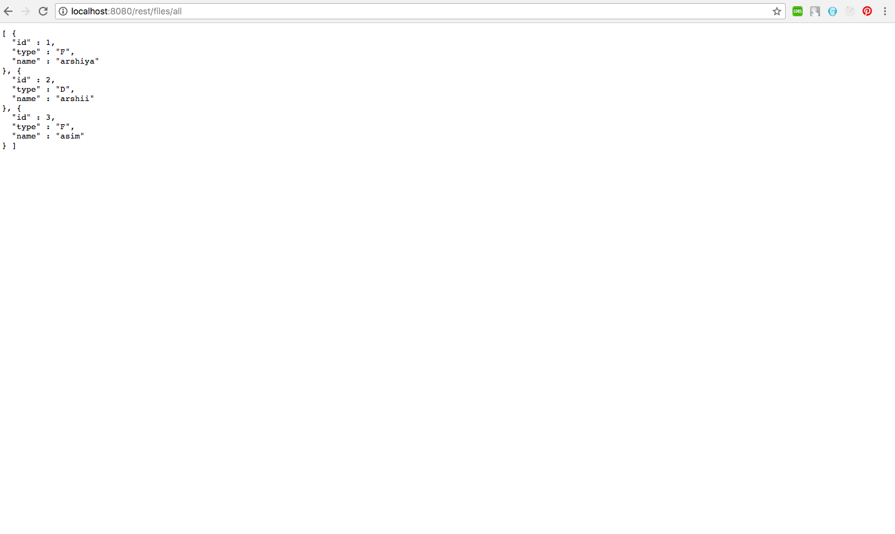
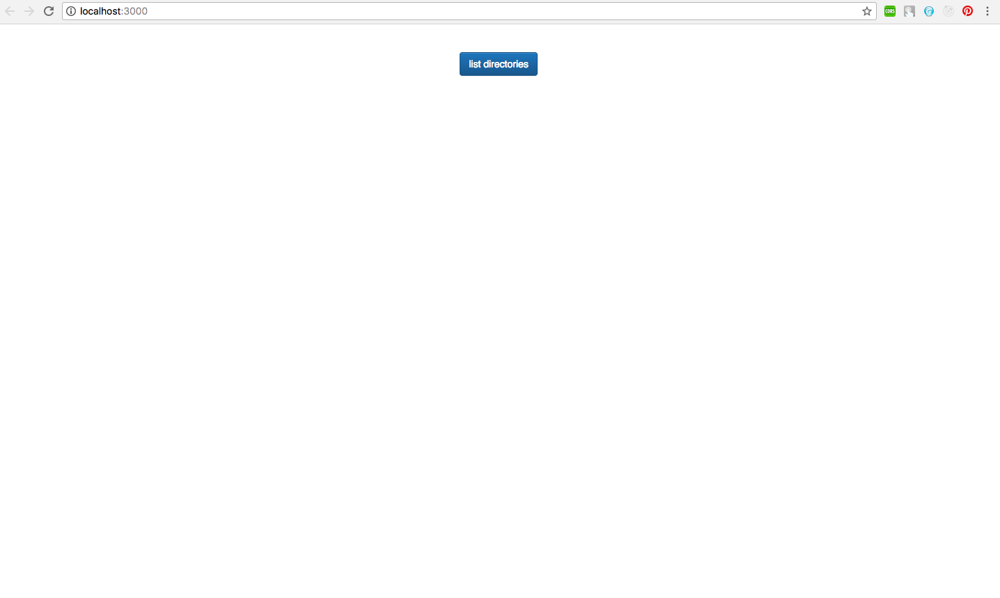
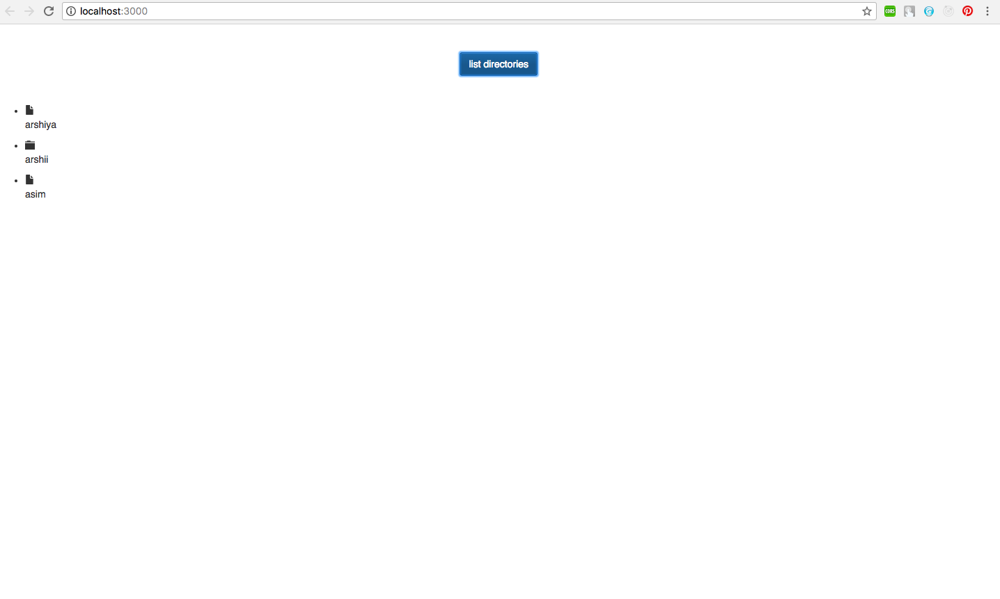

# ListDirectories_Demo

List Directories page using technologies:

• Frontend: ReactJS  
• Backend:  SpringBoot 
• Database: MySQL

Features: 

• List Directories

Steps to run the application:

Back-end server

1. Open backend in IntelliJ (since SpringBoot works best with IntelliJ) and Click Run. The Apache tomcat server will run at port 8080.

Front-end server
1. npm install
2. npm start

Below are some screenshots demonstrating the application:

### Files Listed on port 8080

### Welcome Page

### Directories Listed

